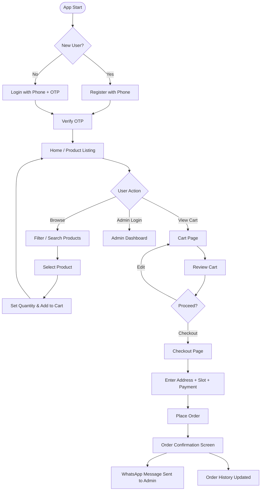

# 🔄 User Flow Document
## VeggieStore — Local Vegetables Delivery App

**Version:** 1.0  
**Date:** April 2026

---

## 1. 🧭 Flow Overview



---

## 2. 👤 Customer Flow

### 2.1 Onboarding (First Visit)

```
App Opens
    │
    ▼
Splash Screen / Landing Page
    │
    ▼
[Phone Number Login Screen]
    │── Enter 10-digit mobile number
    │── Click "Get OTP"
    │
    ▼
[OTP Verification Screen]
    │── Enter 6-digit OTP (simulated)
    │── Click "Verify"
    │
    ▼
[Home Screen] ✅
```

---

### 2.2 Product Browsing

```
Home Screen
    │
    ├─ Search bar (real-time filter)
    │
    ├─ Category filters (Leafy / Root / Seasonal / All)
    │
    └─ Product cards:
           ├─ Product Image
           ├─ Name
           ├─ Price (₹/kg or ₹/unit)
           ├─ Stock indicator (In Stock / Out of Stock)
           └─ [Add to Cart] button
```

---

### 2.3 Cart Management

```
[Add to Cart] tapped on Product
    │
    ▼
Cart Icon badge count increases (+1)
    │
    ▼
[Cart Page]
    │── List of cart items
    │      ├─ Product name + image
    │      ├─ Quantity selector (+ / -)
    │      ├─ Item subtotal
    │      └─ Remove button
    │── Total price displayed
    │── [Proceed to Checkout] button
    │── [Continue Shopping] link
```

---

### 2.4 Checkout Flow

```
[Proceed to Checkout]
    │
    ▼
[Checkout Page]
    │
    ├── Section 1: Delivery Address
    │       ├─ House No / Flat
    │       ├─ Street / Area
    │       └─ Landmark (optional)
    │
    ├── Section 2: Delivery Slot
    │       ├─ ☀️ Morning (6 AM – 10 AM)
    │       └─ 🌇 Evening (5 PM – 8 PM)
    │
    ├── Section 3: Payment Method
    │       ├─ 📱 UPI
    │       └─ 💵 Cash on Delivery
    │
    └── [Place Order] button
```

---

### 2.5 Order Confirmation

```
[Place Order] clicked
    │
    ▼
Order saved to database
    │
    ▼
✅ Toast: "Order placed successfully!"
    │
    ▼
WhatsApp opens with pre-filled order summary
(if customer opts in)
    │
    ▼
[Order Confirmation Screen]
    ├─ Order ID
    ├─ Items summary
    ├─ Total amount
    ├─ Estimated delivery slot
    └─ [Track Order] button
```

---

### 2.6 Order Tracking

```
[My Orders] → Select Order
    │
    ▼
[Order Status Page]
    │
    ░░░ Progress Tracker ░░░
    │
    ⏳ Pending          ← Admin receives order
    📦 Packed           ← Items packed
    🚴 Out for Delivery ← Delivery started
    ✅ Delivered        ← Order complete
```

---

### 2.7 Order History

```
[My Orders Page]
    │
    ├─ List of all past orders
    │      ├─ Order ID & Date
    │      ├─ Items summary
    │      ├─ Total amount
    │      └─ Status badge
    │
    └─ [View Details] → Full order breakdown
```

---

## 3. 🧑‍💼 Admin Flow

### 3.1 Admin Login

```
Admin visits /admin
    │
    ▼
[Admin Login Page]
    ├─ Username input
    ├─ Password input
    └─ [Login] button
    │
    ▼
Credentials verified
    │
    ▼
[Admin Dashboard] ✅
```

---

### 3.2 Admin Dashboard

```
[Dashboard]
    │
    ├── 📊 Stats Cards:
    │       ├─ Today's Orders
    │       ├─ Total Revenue
    │       ├─ Pending Orders
    │       └─ Total Customers
    │
    ├── 📈 Charts:
    │       ├─ Daily orders bar chart
    │       └─ Most ordered vegetables list
    │
    └── Quick Links:
            ├─ [Manage Products]
            ├─ [View Orders]
            └─ [View Customers]
```

---

### 3.3 Product Management Flow

```
[Products Page]
    │
    ├── [+ Add New Product] button
    │       │
    │       ▼
    │   [Product Form Modal]
    │       ├─ Name
    │       ├─ Price (₹)
    │       ├─ Unit (kg/bunch/piece)
    │       ├─ Category
    │       ├─ Stock quantity
    │       ├─ Image upload
    │       └─ [Save] / [Cancel]
    │
    ├── Product List Table:
    │       ├─ Edit ✏️ → Opens pre-filled form
    │       ├─ Delete 🗑️ → Confirm dialog → Remove
    │       └─ Toggle availability 🔘
    │
    └── Search / filter by category
```

---

### 3.4 Order Management Flow

```
[Orders Page]
    │
    ├── Filter Tabs: All | Today | Pending | Completed
    │
    ├── Orders Table:
    │       ├─ Order ID
    │       ├─ Customer Name + Phone
    │       ├─ Items summary
    │       ├─ Total (₹)
    │       ├─ Delivery slot
    │       ├─ Status badge
    │       └─ [Update Status] dropdown
    │               ├─ Pending
    │               ├─ Packed
    │               ├─ Out for Delivery
    │               └─ Delivered
    │
    └── [View Details] → Full order modal
```

---

### 3.5 Customer Management Flow

```
[Customers Page]
    │
    ├── List of all registered customers
    │       ├─ Name
    │       ├─ Phone number
    │       ├─ Total orders
    │       └─ Joined date
    │
    └── [View History] → Customer's past orders
```

---

## 4. 📱 WhatsApp Integration Flow

```
Order Placed by Customer
    │
    ▼
System generates WhatsApp message:
┌──────────────────────────────────────────────┐
│ 🥦 New Order from VeggieStore!               │
│                                              │
│ Order ID: #VG1234                            │
│ Customer: Ramesh Kumar (9876543210)          │
│ Items:                                       │
│    • Tomato x 2 kg — ₹40                   │
│    • Spinach x 1 bunch — ₹10               │
│ Total: ₹50                                  │
│ Slot: Evening (5–8 PM)                      │
│ Payment: Cash on Delivery                   │
│ Address: 12, Main St, Near Temple           │
└──────────────────────────────────────────────┘
    │
    ▼
Opens: https://wa.me/91XXXXXXXXXX?text=...
(Prefilled with order details)
```

---

## 5. 🔔 Notification Touchpoints

| Trigger | Notification Type | Recipient |
|---------|------------------|-----------|
| Item added to cart | Toast (green) | Customer |
| Order placed | Toast (success) + WhatsApp | Customer + Admin |
| Order status updated | Toast / Alert | Customer |
| Product out of stock | Inline warning | Customer |
| Invalid OTP | Error toast | Customer |
| Admin login failed | Error message | Admin |

---

## 6. 📲 Mobile Navigation Structure

```
Bottom Navigation Bar (Mobile)
┌─────────────────────────────────────────┐
│  🏠 Home  │  🔍 Search  │  🛒 Cart  │  👤 Profile  │
└─────────────────────────────────────────┘

Profile Page Options:
    ├─ My Orders
    ├─ Delivery Address
    └─ Logout
```

---

## 7. 🖥️ Desktop Navigation Structure

```
Top Navigation Bar (Desktop)
┌──────────────────────────────────────────────────────────┐
│  🌿 VeggieStore  │  Home  │  Shop  │  Cart 🛒  │  Login │
└──────────────────────────────────────────────────────────┘

Admin Sidebar (Desktop):
    ├─ 📊 Dashboard
    ├─ 🥦 Products
    ├─ 📦 Orders
    ├─ 👥 Customers
    └─ 🚪 Logout
```

---

## 8. 🔁 Edge Cases & Error Handling

| Scenario | Behavior |
|----------|----------|
| Product out of stock | Disable "Add to Cart", show "Out of Stock" |
| Empty cart on checkout | Redirect to Home with toast warning |
| OTP expired (simulated) | Show "Resend OTP" after 30s |
| Network error | Show error toast, retry option |
| Order address outside 2 km | Show warning (future GPS feature) |
| Admin tries wrong password | Show "Invalid credentials" for 3 tries, then lock for 5 min |

---

*This document describes the complete user journeys for both customers and admins in the VeggieStore application.*
